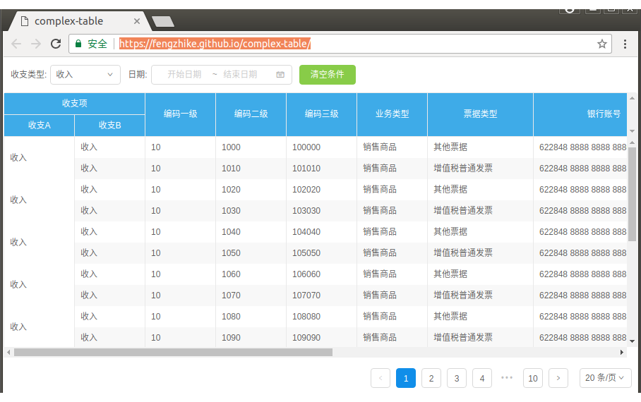
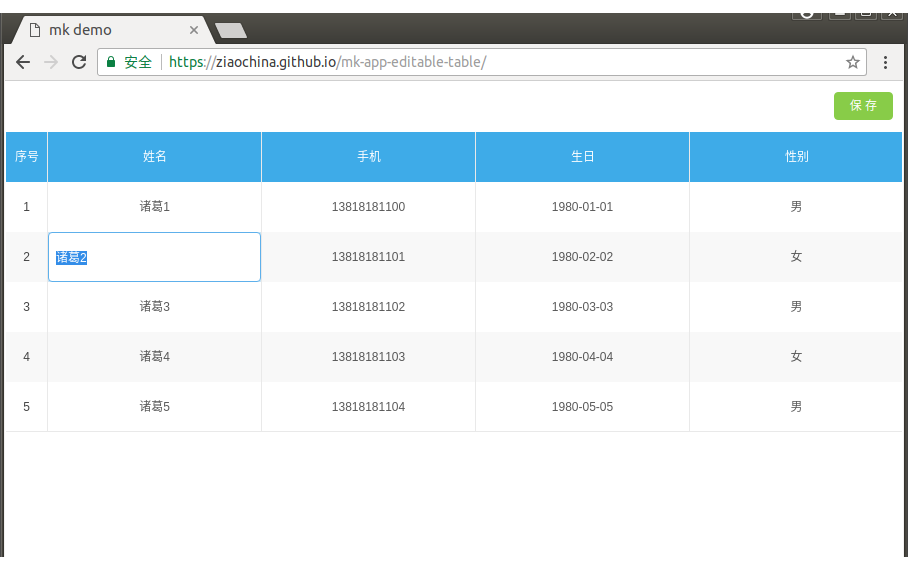
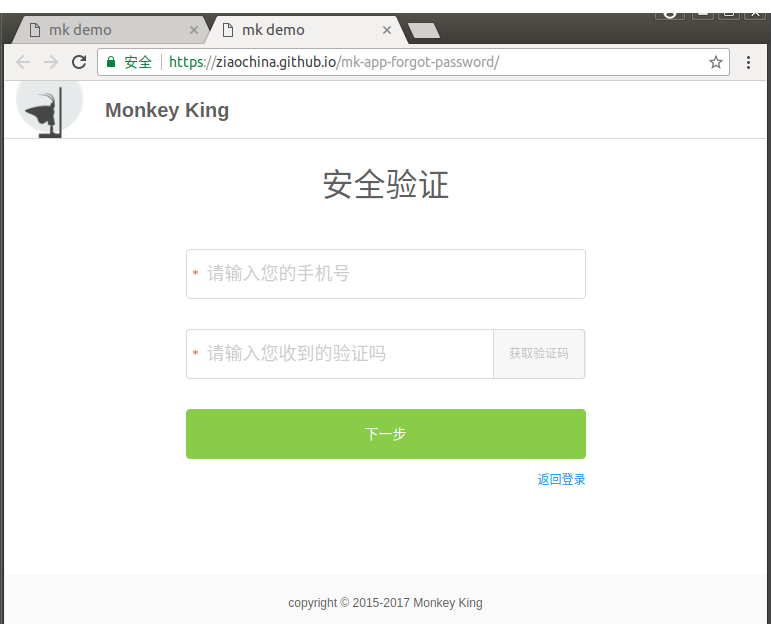
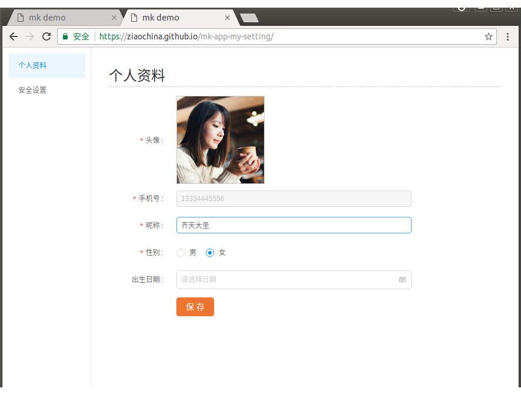
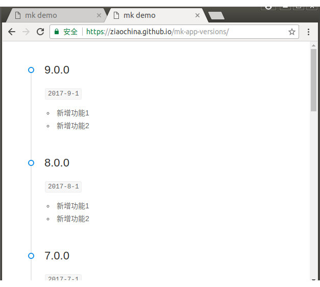
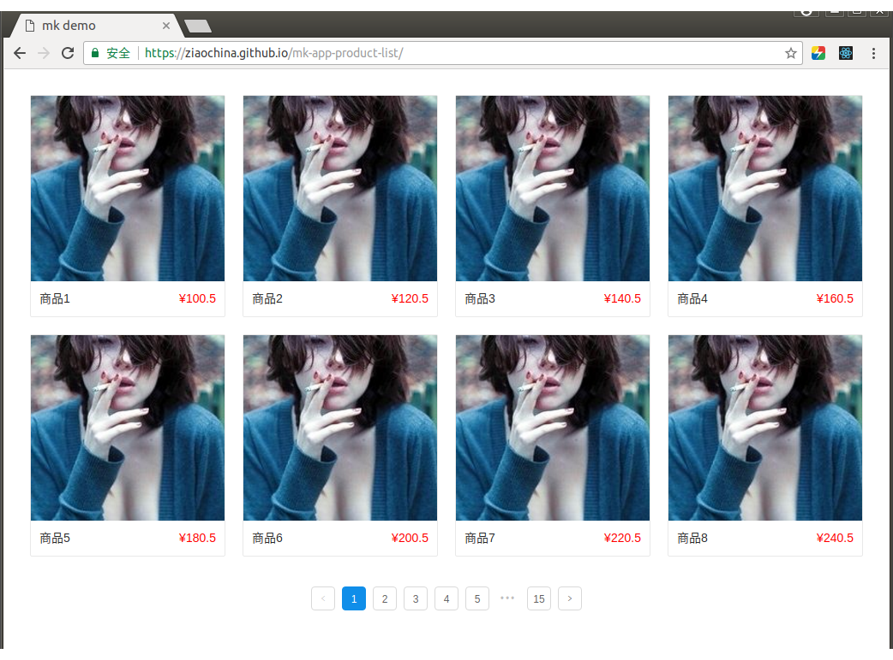
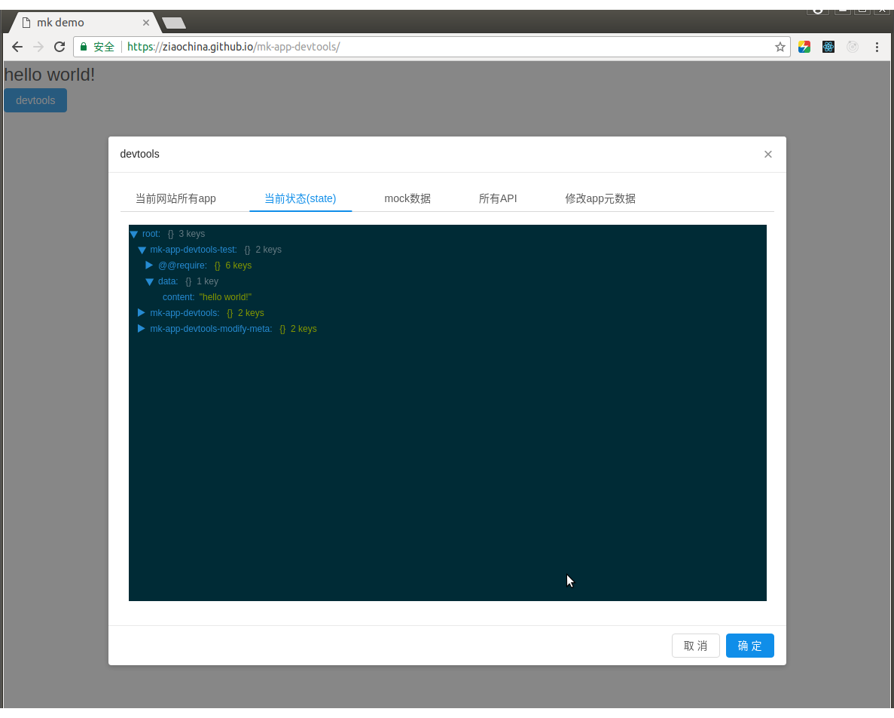
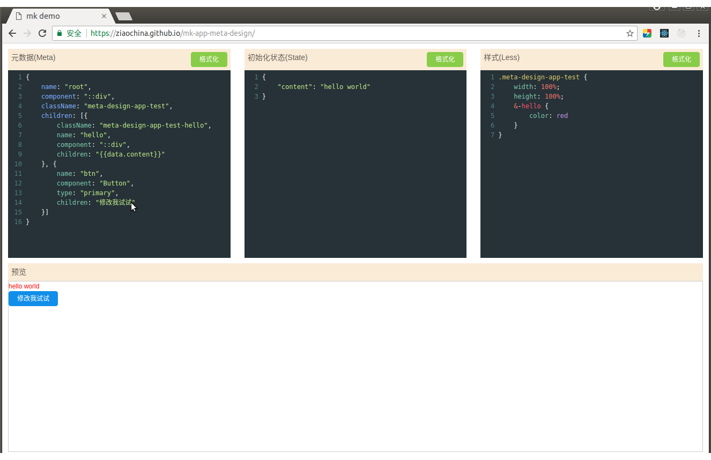

# App应用模板项目

App模板项目，依赖mk核心项目实现的，并发布到npmjs，可以使用mk clone命令，克隆到本地website下

## 1、mk-app-root <a href="https://github.com/ziaochina/mk-app-root" target="_blank">[代码]</a>  <a href="https://ziaochina.github.io/mk-app-root" target="_blank">[在线demo]</a>

- root模板，可以作为website的start app使用，它赋予子组件或app,redirect能力

## 2、mk-app-login <a href="https://github.com/ziaochina/mk-app-login" target="_blank">[代码]</a>  <a href="https://ziaochina.github.io/mk-app-login" target="_blank">[在线demo]</a>

- 登录模板，克隆后根据需求修改

### 3、mk-app-portal <a href="https://github.com/ziaochina/mk-app-portal" target="_blank">[代码]</a>  <a href="https://ziaochina.github.io/mk-app-portal" target="_blank">[在线demo]</a>

- 门户模板，克隆后根据需求修改

## 4、mk-app-person-list <a href="https://github.com/ziaochina/mk-app-person-list" target="_blank">[代码]</a>  <a href="https://ziaochina.github.io/mk-app-person-list" target="_blank">[在线demo]</a>

- 列表模板，克隆后根据需求修改

## 5、mk-app-person-card  <a href="https://github.com/ziaochina/mk-app-person-card" target="_blank">[代码]</a>  <a href="https://ziaochina.github.io/mk-app-person-card" target="_blank">[在线demo]</a>

- 卡片模板，克隆后根据需求修改

## 6、mk-app-bar-graph  <a href="https://github.com/ziaochina/mk-app-bar-graph" target="_blank">[代码]</a>  <a href="https://ziaochina.github.io/mk-app-bar-graph" target="_blank">[在线demo]</a>

- 柱状图模板，克隆后根据需求修改

## 7、mk-app-complex-table  <a href="https://github.com/fengzhike/mk-app-complex-table" target="_blank">[代码]</a>  <a href="https://fengzhike.github.io/mk-app-complex-table" target="_blank">[在线demo]</a>

- 复杂表格模板，克隆后根据需求修改

## 8、mk-app-tree-table  <a href="https://github.com/ziaochina/mk-app-tree-table" target="_blank">[代码]</a>  <a href="https://ziaochina.github.io/mk-app-tree-table" target="_blank">[在线demo]</a>

- 左树右表模板，克隆后根据需求修改

## 9、mk-app-editable-table  <a href="https://github.com/ziaochina/mk-app-editable-table" target="_blank">[代码]</a>  <a href="https://ziaochina.github.io/mk-app-editable-table" target="_blank">[在线demo]</a>

- 可编辑表格模板，克隆后根据需求修改

## 10、mk-app-voucher  <a href="https://github.com/ziaochina/mk-app-voucher" target="_blank">[代码]</a>  <a href="https://ziaochina.github.io/mk-app-voucher" target="_blank">[在线demo]</a>

- 单据模板，克隆后根据需求修改

 
 ## 11、mk-app-register  <a href="https://github.com/ziaochina/mk-app-register" target="_blank">[代码]</a>  <a href="https://ziaochina.github.io/mk-app-register" target="_blank">[在线demo]</a>

- 注册模板，克隆后根据需求修改

 ## 12、mk-app-forgot-password  <a href="https://github.com/ziaochina/mk-app-forgot-password" target="_blank">[代码]</a>  <a href="https://ziaochina.github.io/mk-app-forgot-password" target="_blank">[在线demo]</a>

- 忘记密码模板，克隆后根据需求修改

 ## 13、mk-app-modify-password  <a href="https://github.com/ziaochina/mk-app-modify-password" target="_blank">[代码]</a>  <a href="https://ziaochina.github.io/mk-app-modify-password" target="_blank">[在线demo]</a>

- 修改密码模板，克隆后根据需求修改

 ## 14、mk-app-my-setting  <a href="https://github.com/ziaochina/mk-app-my-setting" target="_blank">[代码]</a>  <a href="https://ziaochina.github.io/mk-app-my-setting" target="_blank">[在线demo]</a>

- 个人设置模板，克隆后根据需求修改

 ## 15、mk-app-versions  <a href="https://github.com/ziaochina/mk-app-versions" target="_blank">[代码]</a>  <a href="https://ziaochina.github.io/mk-app-versions" target="_blank">[在线demo]</a>

- 版本时间轴模板，克隆后根据需求修改

 ## 16、mk-app-home  <a href="https://github.com/ziaochina/mk-app-home" target="_blank">[代码]</a>  <a href="https://ziaochina.github.io/mk-app-home" target="_blank">[在线demo]</a>

- 首页模板，克隆后根据需求修改

 ## 17、mk-app-report  <a href="https://github.com/ziaochina/mk-app-report" target="_blank">[代码]</a>  <a href="https://ziaochina.github.io/mk-app-report" target="_blank">[在线demo]</a>

- 报表模板，克隆后根据需求修改

 ## 18、mk-app-product-list  <a href="https://github.com/ziaochina/mk-app-product-list" target="_blank">[代码]</a>  <a href="https://ziaochina.github.io/mk-app-product-list" target="_blank">[在线demo]</a>

- 商品列表模板，克隆后根据需求修改

 ## 19、mk-app-devtools  <a href="https://github.com/ziaochina/mk-app-devtools" target="_blank">[代码]</a>  <a href="https://ziaochina.github.io/mk-app-devtools" target="_blank">[在线demo]</a>

- 开发者工具模板，克隆后根据需求修改

## 20、mk-app-meta-design  <a href="https://github.com/ziaochina/mk-app-meta-design" target="_blank">[代码]</a>  <a href="https://ziaochina.github.io/mk-app-meta-design" target="_blank">[在线demo]</a>

- 元数据设计模板，克隆后根据需求修改

