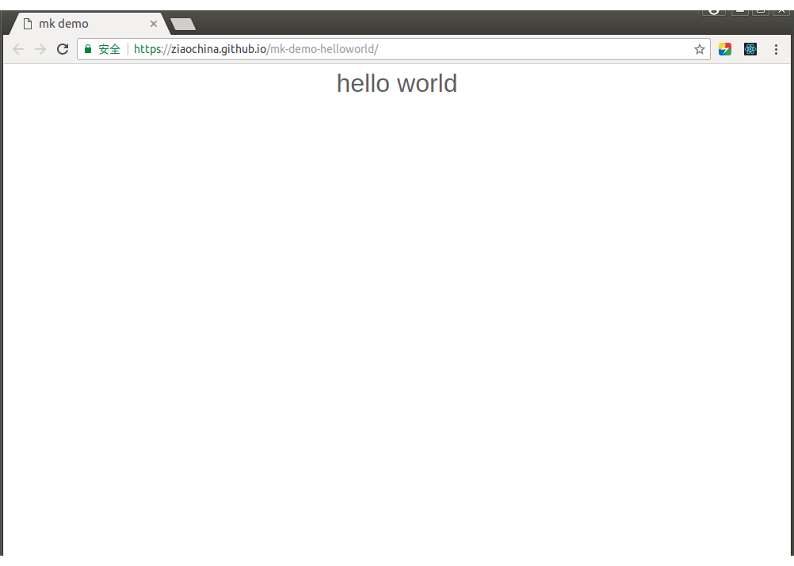
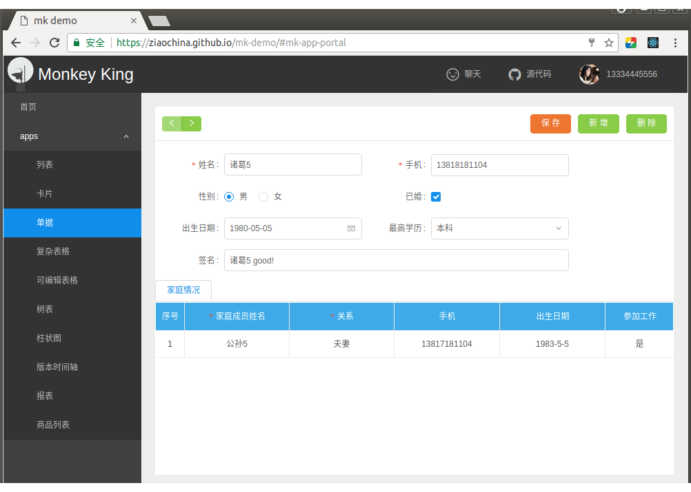

# 示例

## 1、HelloWorld
- <a target="_blank" href="https://github.com/ziaochina/mk-demo-helloworld">[代码]</a> 
<a  target="_blank" href="https://ziaochina.github.io/mk-demo-helloworld/">[在线预览]</a> 

- 内容：前端Website、App 

- 截图：

## 2、企业门户前端 
- <a target="_blank" href="https://github.com/ziaochina/mk-demo">[代码]</a> 
<a  target="_blank" href="https://ziaochina.github.io/mk-demo/">[在线预览]</a> 

- 内容：前端Website、App
- 截图：

